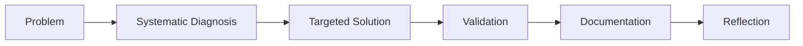

# Full-Stack Development with GitHub Copilot - Reflection

## Project Overview
This project demonstrates a Blazor WebAssembly client consuming a .NET 8 Minimal API server. The journey involved multiple debugging challenges and iterative improvements with Copilot assistance.

## How Copilot Assisted

### 🔧 Integration Code Generation
- **HttpClient Configuration**: Generated proper service registration for cross-origin API calls
- **JSON Serialization**: Configured industry-standard JSON options with camelCase naming and case-insensitive parsing
- **CORS Setup**: Added comprehensive CORS policy for Blazor-to-API communication
- **Typed Models**: Replaced anonymous objects with strongly-typed classes for better maintainability

### 🐛 Debugging Complex Issues
- **API Endpoint Mismatches**: Identified discrepancy between server endpoint (`/api/products`) and client call (`/api/productlist`)
- **Base Address Problems**: Discovered HttpClient was pointing to client's own address instead of server
- **Process Management**: Helped resolve port conflicts and application startup issues
- **JSON Deserialization**: Fixed case sensitivity issues between server response and client models

### 📊 JSON Response Structure
```csharp
// Before: Anonymous objects
return new[] { new { Id = 1, Name = "Laptop" } };

// After: Validated typed models
return Results.Ok(new List<Product> { 
    new Product { Id = 1, Name = "Laptop", Price = 1200.50m } 
});
```

### ⚡ Performance & Standards Optimization
- **Data Annotations**: Implemented server-side validation with `[Required]`, `[Range]`, `[StringLength]`
- **RFC 7807 Problem Details**: Added standardized error responses
- **Decimal for Currency**: Changed from `double` to `decimal` for precise monetary calculations
- **Proper HTTP Status Codes**: Implemented 200 OK, 201 Created, 400 Bad Request patterns

## Major Challenges Encountered

### 1. **Overcomplicated Initial Approach** ⚠️
**Challenge**: Made debugging unnecessarily complex by fixing issues one at a time instead of systematic diagnosis.

**How Copilot Helped**: 
- Provided a systematic checklist approach for full-stack troubleshooting
- Learned to diagnose all core issues upfront (endpoints, CORS, HttpClient, processes)

**Lesson Learned**: Start with systematic diagnosis rather than piecemeal fixes.

### 2. **Directory Navigation Chaos** 🗂️
**Challenge**: Repeatedly got lost in terminal navigation between project directories.

**How Copilot Helped**:
- Automated directory checking with `Get-Location` and `Get-ChildItem`
- Used absolute paths to avoid navigation issues

**Lesson Learned**: Use workspace-relative commands and verify current directory before operations.

### 3. **Process Management Confusion** 🔄
**Challenge**: Multiple dotnet processes running on same ports, causing binding failures.

**How Copilot Helped**:
- Generated PowerShell commands to identify and kill conflicting processes
- Implemented proper process cleanup strategies

**Lesson Learned**: Always check for existing processes before starting new ones.

## Effective Copilot Usage Patterns

### ✅ What Worked Well

1. **Systematic Problem-Solving**: 
   ```
   Quick Diagnostic Checklist:
   1. Are both apps running?
   2. Do endpoints match?
   3. Is CORS configured?
   4. Is HttpClient pointing correctly?
   5. Are data models compatible?
   ```

2. **Multi-File Edits**: Used `multi_replace_string_in_file` for efficient bulk changes

3. **Industry Standards**: Generated code following .NET conventions and HTTP standards

4. **Comprehensive Documentation**: Added detailed comments explaining both implementation and rationale

### ❌ What Could Be Improved

1. **Initial Complexity**: Overcomplicated simple configuration issues
2. **Sequential Debugging**: Fixed issues one-by-one instead of holistic approach
3. **Terminal Management**: Could have used better workspace navigation strategies

## Key Learnings About Copilot in Full-Stack Development

### 🎯 Best Practices Discovered

1. **Start with Architecture**: Understand the full-stack flow before diving into details
2. **Use Diagnostic Tools**: Leverage Copilot for systematic troubleshooting approaches
3. **Industry Standards First**: Ask for standards-compliant implementations from the start
4. **Documentation as Code**: Generate comments that explain both "what" and "why"

### 🔄 Iterative Improvement Process



### 💡 Copilot Superpowers in Full-Stack

- **Cross-Technology Integration**: Seamlessly handled Blazor ↔ API communication
- **Configuration Generation**: Automated complex JSON/CORS/validation setup
- **Error Pattern Recognition**: Quickly identified common full-stack pitfalls
- **Standards Enforcement**: Applied industry best practices consistently

## Conclusion

GitHub Copilot proved invaluable for full-stack development, especially when:
- Following systematic troubleshooting approaches
- Implementing industry standards and best practices
- Generating boilerplate with proper error handling
- Documenting complex integration patterns

The key insight: **Copilot works best when given clear, systematic direction rather than ad-hoc problem-solving requests.**

---
*Generated with GitHub Copilot assistance | February 2, 2026*